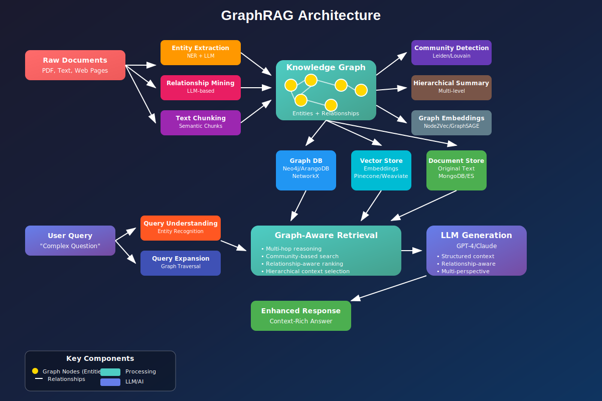

## GraphRAG vs Traditional RAG

[Visual workflow showing how GraphRAG works and how it differs from traditional RAG systems](https://claude.ai/public/artifacts/8373178a-1872-4780-a2e4-8020144525b7?fullscreen=true)

## GraphRAG architecture diagram

